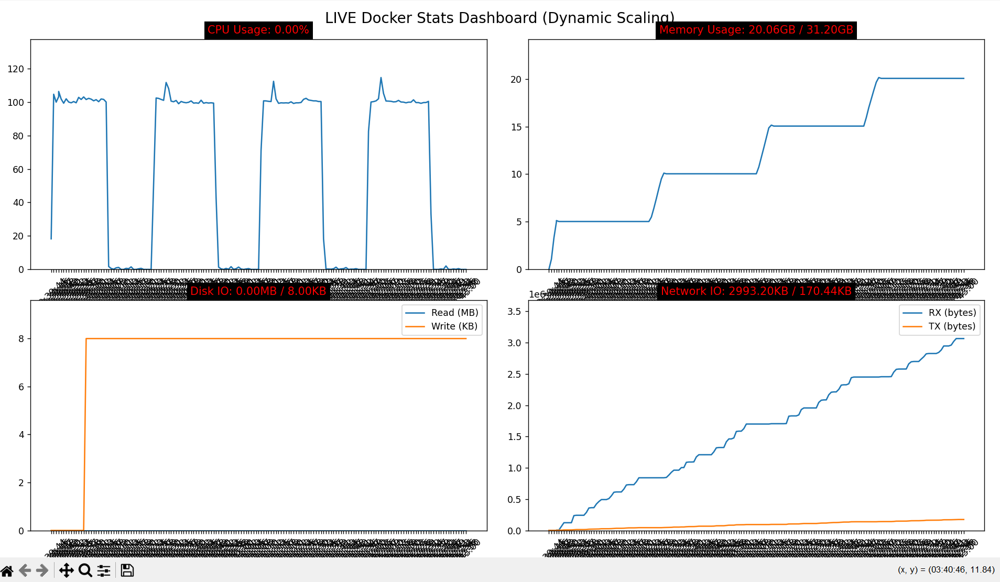
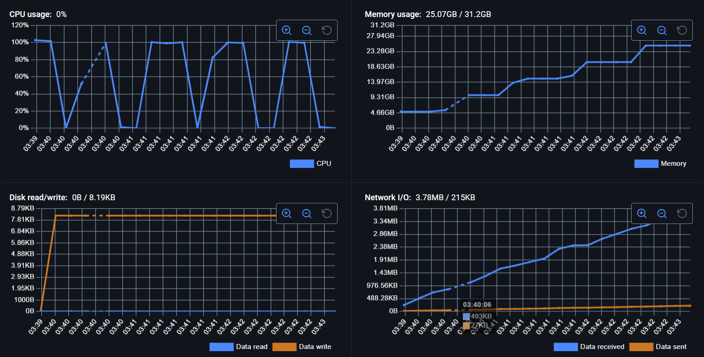

# Docker Stats Monitoring Dashboard

A real-time Docker container resource monitoring tool that displays CPU, Memory, Network I/O, and Disk I/O statistics in a live-updating matplotlib dashboard. This project extracts the underlying logic from Docker Desktop's Stats tab and renders the graphs for web interface integration.

## About

This project is designed to display the resource statistics of a running Docker container, similar to the "Stats" tab in Docker Desktop. I'm building it to extract the underlying logic and render the graphs on a web interface, where my clients can run Docker containers and monitor their resource usage in real time.

## Features

- **Real-time Monitoring**: Live-updating dashboard showing container resource usage
- **Comprehensive Metrics**: 
  - CPU usage percentage (calculated identically to Docker Desktop)
  - Memory usage (used vs. limit in GB)
  - Network I/O (RX/TX bytes)
  - Disk I/O (Read/Write operations)
- **Automatic Container Management**: 
  - Automatically builds Docker image if not found
  - Removes old containers before creating new ones
  - Streams container stats in real-time
- **Dynamic Scaling**: Graphs automatically adjust their Y-axis based on current values
- **Clean Architecture**: Separated responsibilities for image management, container management, and visualization

## Screenshots

### Live Dashboard Generated by Code



The dashboard displays four real-time graphs:
- **Top Left**: CPU Usage percentage over time
- **Top Right**: Memory Usage (GB) with limit indication
- **Bottom Left**: Disk I/O operations (Read in MB, Write in KB)
- **Bottom Right**: Network I/O (RX/TX in KB)

### Docker Stats Comparison



This project replicates the functionality of Docker Desktop's Stats tab, providing the same metrics and calculations for integration into web interfaces.

## Prerequisites

- **Python 3.7+**
- **Docker Desktop** or **Docker Engine** installed and running
- **Docker Python SDK** access (Docker daemon must be accessible)

## Installation

1. **Clone or download this repository**

2. **Install Python dependencies**:
   ```bash
   pip install docker matplotlib
   ```

3. **Ensure Docker is running**:
   - On Windows/Mac: Start Docker Desktop
   - On Linux: Ensure Docker daemon is running (`sudo systemctl start docker`)

## Usage

1. **Configure the container** (optional):
   - Edit `IMAGE_NAME`, `CONTAINER_NAME`, and `IMAGE_PATH` in `main.py` if you want to monitor a different container
   - Default configuration monitors a container built from `./billingsimulation/`

2. **Run the monitoring script**:
   ```bash
   python main.py
   ```

3. **The script will**:
   - Check if the Docker image exists, build it if not found
   - Remove any existing container with the same name
   - Create and start a new container
   - Open a matplotlib window showing real-time stats
   - Update graphs every 900ms (0.9 seconds)

4. **Close the dashboard**:
   - Close the matplotlib window to stop monitoring
   - The container will continue running in the background

## Technical Details

### CPU Calculation

The CPU percentage calculation matches Docker Desktop's algorithm exactly:
- Calculates CPU delta between current and previous stats
- Accounts for system CPU usage and number of CPUs
- Handles edge cases when system stats are unavailable

### Stats Collection

- Uses Docker's `container.stats(stream=True)` API
- Parses JSON statistics in real-time
- Maintains a rolling buffer of 200 data points per metric
- Updates visualization every 900ms

### Architecture

The code follows a clean separation of concerns:
- **Image responsibilities**: Building and checking Docker images
- **Container responsibilities**: Creating, removing, and managing containers
- **Orchestrator**: Coordinates image and container operations
- **Visualization**: Handles stats formatting and matplotlib rendering

### Key Functions

- `image_exists()`: Checks if a Docker image exists
- `build_image()`: Builds a Docker image from a path
- `remove_container()`: Safely removes existing containers
- `create_container()`: Creates and starts a new container
- `calculate_cpu_percent()`: Calculates CPU usage matching Docker Desktop
- `format_stats()`: Extracts and formats statistics from Docker JSON
- `animate()`: Animation loop that updates graphs in real-time

## Configuration

You can customize the monitoring by editing these constants in `main.py`:

```python
IMAGE_NAME = "billingsimulation"          # Docker image name
CONTAINER_NAME = "billingsimulation_live" # Container name
IMAGE_PATH = "./billingsimulation"        # Path to Dockerfile
```

## Notes

- The container runs in detached mode and continues after the dashboard closes
- To stop the container manually: `docker stop billingsimulation_live`
- The dashboard window must remain open to continue monitoring
- Graph scaling is dynamic and adjusts based on current values

## Future Enhancements

This project is designed to be integrated into a web interface where:
- Historical data can be stored and analyzed
- Clients can access monitoring dashboards remotely
- Alerts can be configured based on resource thresholds

---

**Built with**: Python, Docker SDK, Matplotlib

